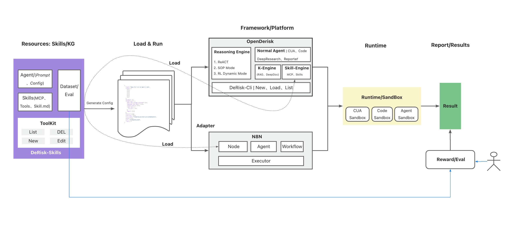
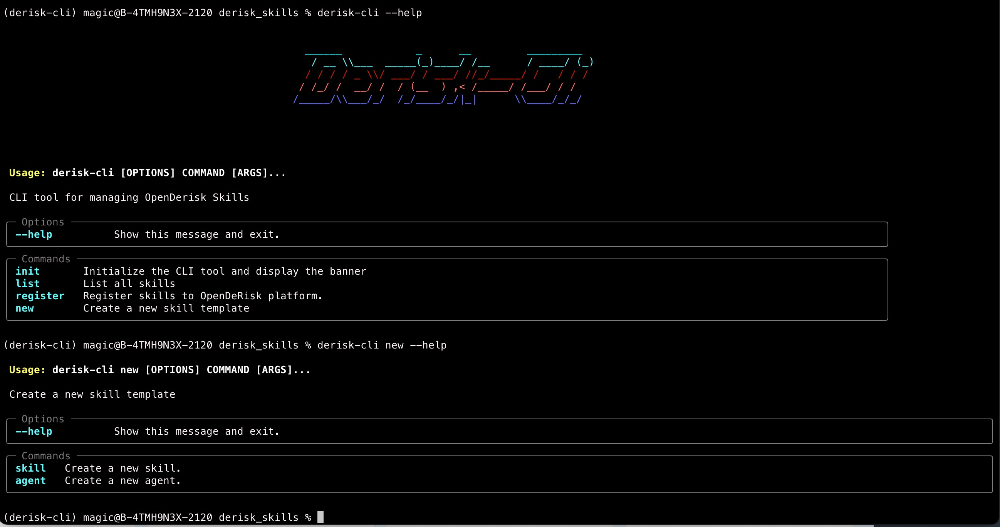

## Derisk_Skills
_________
DeRisk-Skills are community-Powered AIOps Skills for OpenDerisk. 


<div align="center">
  <p>
    <a href="https://github.com/derisk-ai/OpenDerisk">
        
    </a>
    <a href="https://github.com/derisk-ai/OpenDerisk">
        
    </a>
    <a href="https://opensource.org/licenses/MIT">
      
    </a>
     <a href="https://github.com/derisk-ai/OpenDerisk/releases">
      
    </a>
    <a href="https://github.com/derisk-ai/OpenDerisk/issues">
      
    </a>
    <a href="https://codespaces.new/derisk-ai/OpenDerisk">
      
    </a>
  </p>

[**English**](README.md) | [**简体中文**](README.zh.md) | [**日本語**](README.ja.md) | [**视频教程**](https://www.youtube.com/watch?v=1qDIu-Jwdf0)
</div>

## Key features

<p align="left">
  
</p>

- A Group of Toolkit to build AIOps skills
- [MCP support](https://github.com/modelcontextprotocol)
- [Agent Skills support](https://github.com/anthropics/skills)

## Quick Start
Derisk-skills is published as a Python package on PyPI. we highly recommend installing it with [uv](https://github.com/astral-sh/uv). If you have not installed uv yet, please follow the instructions [here](https://docs.astral.sh/uv/#installation) to install it first.

### Installation
Once uv is installed, you can install derisk-skills with:

> uv tool install derisk-cli

### Usage
Run derisk-cli command in the directory you want to work on, `derisk-cli --help` 

<p align="left">
  
</p>


### Skills(技能)

We use Skills to organize the resources needed by the Agent. The resources included in Skills are as follows:

1. MCP Server
2. Tools/Scripts
3. Knowledge
4. Datasets For eval

### Content Schema 

In OpenDerisk Skills, we use the `SPEC` specification based on `markdown` text for skill organization and description, and strictly adhere to the [Agent Skills](https://www.anthropic.com/engineering/equipping-agents-for-the-real-world-with-agent-skills) specification published by Anthropics through relevant specifications. Based on domain considerations, we have made certain extensions.

#### File Structure
```
skills/
├── logskill/
│   ├── SKILL.md
│   ├── KNOWLEDGE.md
│   ├── tools/
│   │   └── INDEX.md 
│   │   ├── __init__.py
│   │   └── logutil.py 
│   │   └── analysis.py 
│   ├── knowledge/
│   │   └── deepwiki.md 
│   │   └── error_code.md 
├── README.md
```

#### Content Format 
- [SKILL Format](./src/skills/README.md)

## Acknowledgement 
- [MCP](https://github.com/modelcontextprotocol)
- [Agent Skills](https://github.com/anthropics/skills)
